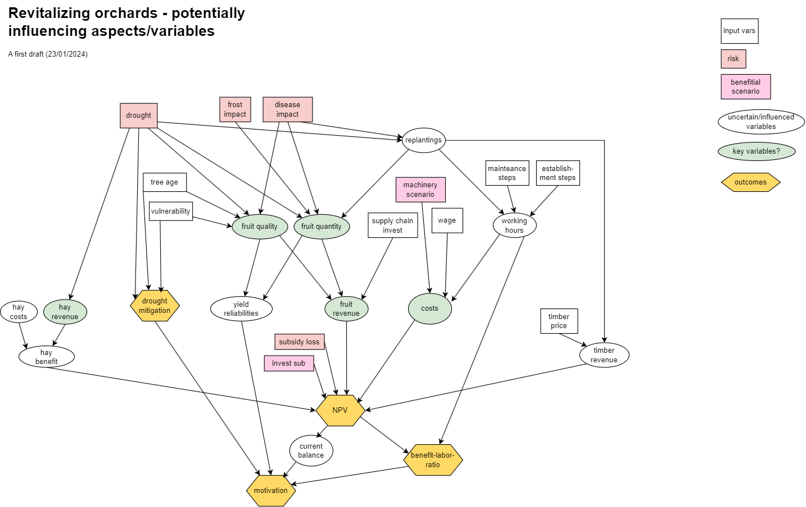

# holistic_agroforestry_farm_model

This model explores an [Decision Analysis Approach](https://doi.org/10.1186/s43170-023-00151-9) for agricultural interventions. 
It represents a farmer's decision to revitalize their orchard meadows by planting walnut trees where former trees have died, to preserve the habitat character and generate additional economic income.

## Description
The decision has environmental aspects (i.e. risks by diseases, droughts, or spring frosts; tree-age specific vulnerability for those risks), economical (labor efforts, machinery prices, supply chain scenarios), and political aspects (subsidies, scneario for an investition subsidy and shared machinery investement scenario). 

The model's logic is identified in the conceptual model. 

## Usage

By usuage of the [decisionSupport](https://cran.r-project.org/web/packages/decisionSupport/index.html) package, the decision is implemented in `main_code3.r`:
* The logical model is implemented as `orchard_revitalization` code function.
* Posterior distributions are simulated using Marcov Chain Monte Carlo Simulations with the `mcSimulation` function, with `n=100000` model runs.
Knowledge gaps are identified by Expected Value of Perfect Information analysis `multi_EVPI`. For sensitivity analyses by Variable Influence Projecten based on Partial Lest Square regression (VIP-PLS), the `plsr.mcSimulation` function is used.

The required data input are 3 data tables stored in the Data folder (`data_agency.xlsx`, `data_estimates.xlsx`, and `data_variables.xlsx`) where variable names and their prior distributions are stored.

Output graphs can be stored as `svg` files. Examples are found in the `Output` folder. 

Further packages are requires: `tidyverse`, `readxl`, `svglite`.

## Archive
Interim Approaches have been stored in "Archive" and were branched. 

## Author and Acknowledge
Heidi Hoffmann, heidi.hoffmann@stud.uni-goettingen.de
For the Module "Project Ecosystem ANalysis and Modelling", submission 14th March 2025.

Many Thanks to Cory WHitney (Uni Bonn) for his great support and advise!

## Project status
Closed.
